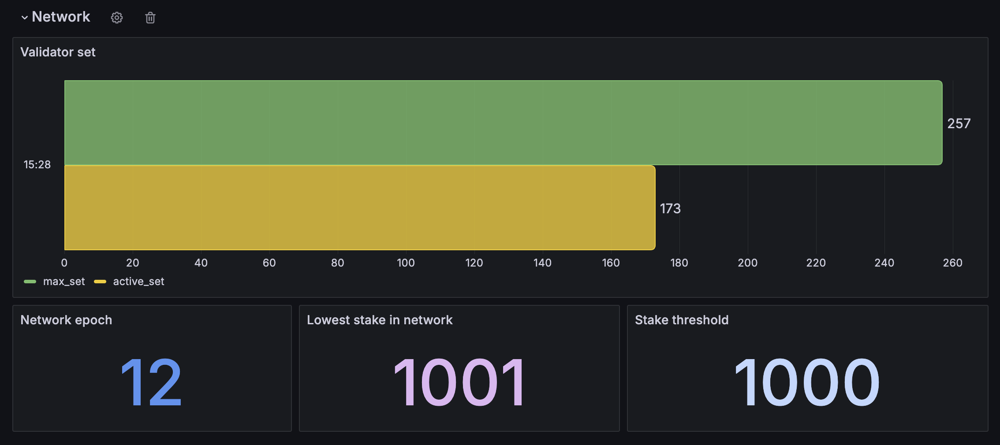
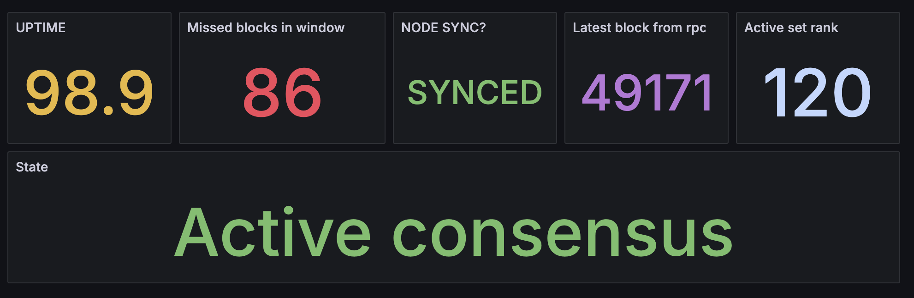
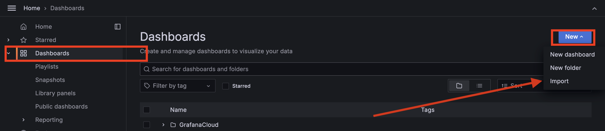

# Namada validator dashboard for Grafana

## Importing the dashboard
1. Copy contents of the `dashbaord/namada-validator-dashboard.json` file from this repository.
2. Go to your Grafana dashboard and click on the `New` button on the top right side of the screen.
3. Click on `Import` and select the `dashboard/namada-validator-dashboard.json` file or paste contents of it.

## Use exporter
Check out the [Namada validator exporter](https://github.com/EvgenyKhlivetsky/namada-exporter)